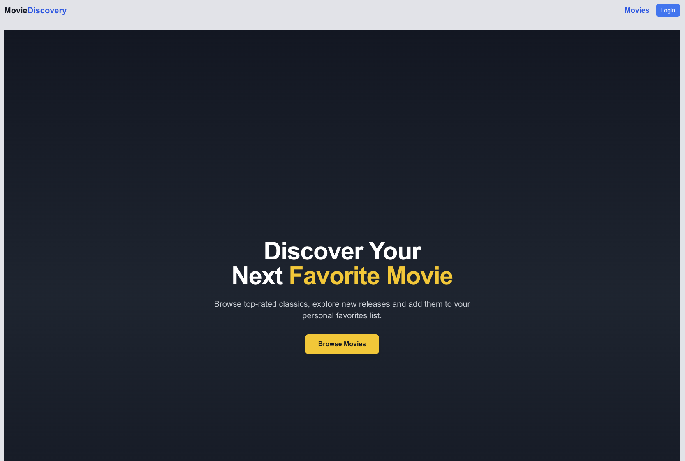
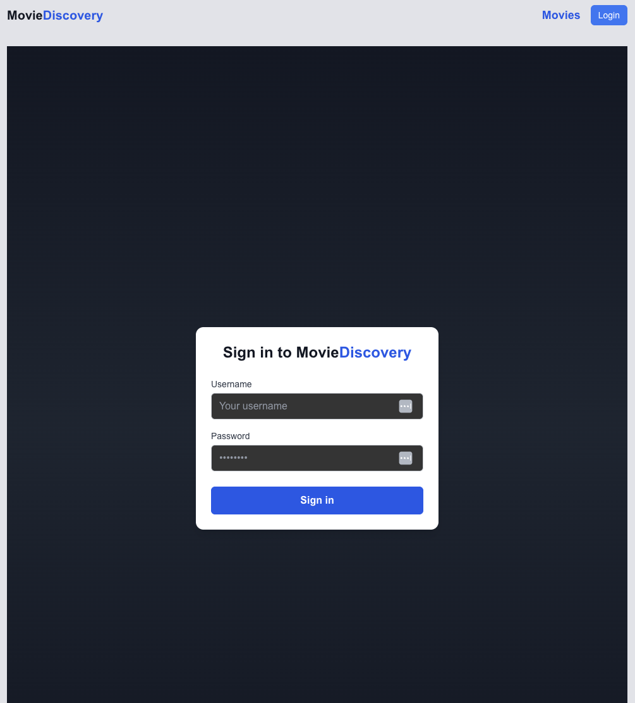
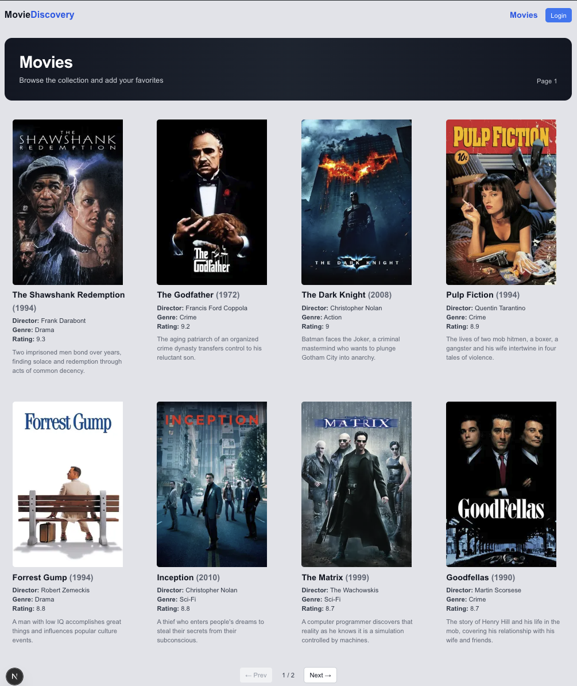
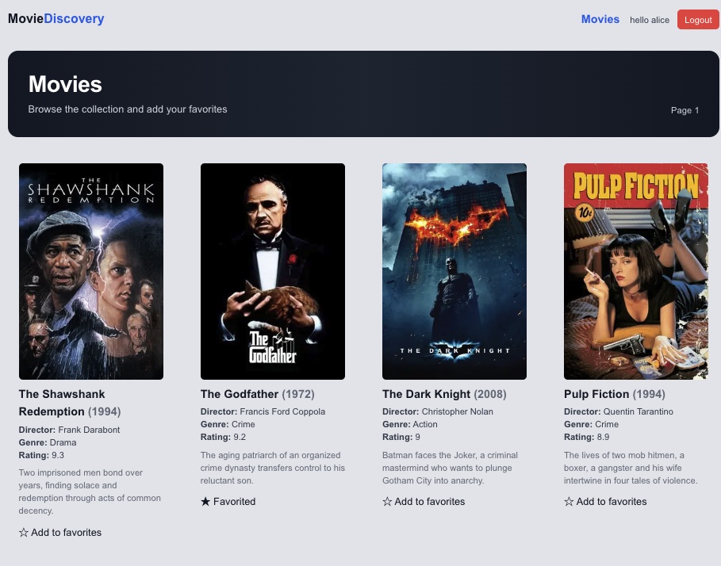
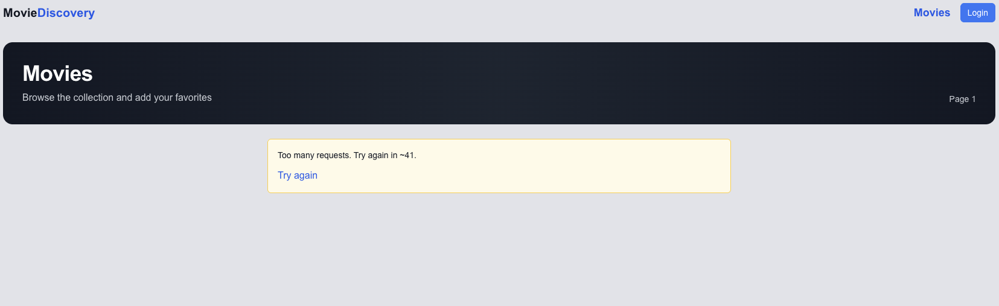
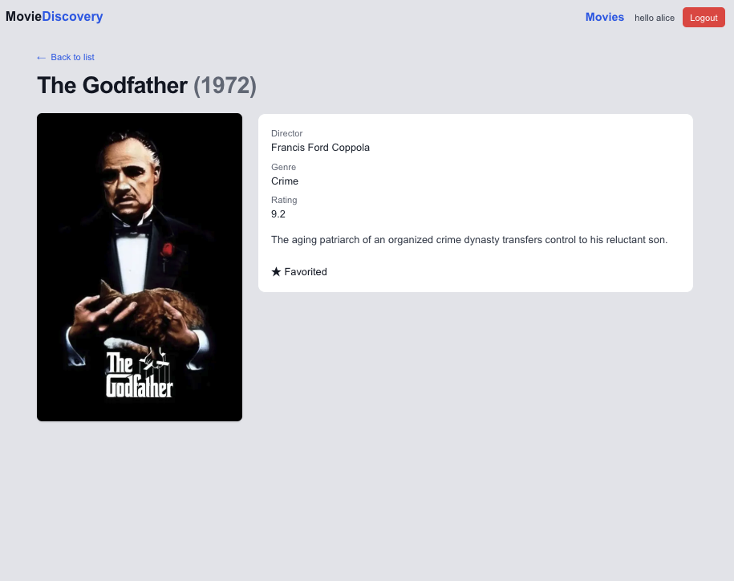

## Movie Discovery App

Μια εφαρμογή με authentication που επιτρέπει στον χρήστη να συνδεθεί και να κάνει περιήγηση σε μια συλλογή απο 16 ταινίες χωρισμένες σε 2 paginated σελίδες.
Ο χρήστης μπορεί να επιλέξει την ταινία που θέλει για να δει τις λεπτομέρειές της καθώς και για την προσθέσει στα αγαπημένα.

run the app:

```bash
npm install
npm run dev
```

ανοίγουμε [http://localhost:3000](http://localhost:3000) με τον browser για το αποτέλεσμα

## Tech Stack

+Next.js 15 (App Router) -> Server Components, SSR/SEO, dynamic routes
+TailwindCSS -> styling
+Node fetch -> Κλήσεις στο Movie API

## Requirements & Πώς Καλύφθηκαν

| Requirement                    | Υλοποίηση                                                                                                                                                                                                                                                                                      |
| ------------------------------ | ---------------------------------------------------------------------------------------------------------------------------------------------------------------------------------------------------------------------------------------------------------------------------------------------- |
| **Movie Browsing**             | `/movies` σελίδα με **server-rendered** λίστα ταινιών. Grid layout με Tailwind. Κάρτες ταινιών με poster, τίτλο, έτος, σκηνοθέτη, genre, rating, περιγραφή. Pagination 8 ταινίες/σελίδα.                                                                                                       |
| **Movie Detail Page**          | Dynamic route `/movies/[id]` με SSR. Δείχνει πλήρη στοιχεία ταινίας, optimized εικόνα, και για logged-in χρήστη εμφανίζει κουμπί **Add/Remove Favorite**.                                                                                                                                      |
| **Authentication System**      | `/login` σελίδα με client form. Κλήση στο API `/api/login`, αποθήκευση JWT σε **httpOnly cookie**. Το cookie διαβάζεται στον server (`getAuthFromCookies`) ώστε το login state να παραμένει και σε refresh / νέα session.                                                                      |
| **Favorites Management**       | Προστατευμένα endpoints `/api/favorites/[id]` (proxy στο Movie API). Κουμπί Favorite εμφανίζεται σε list & detail page. Optimistic UI + server validation (γίνεται η αλλαγή στο fe όσο παράλληλα γίνεται και στον server. Αν ο server δεν επιβεβαιώσει την αλλαγή τότε γίνεται revert στο ui). |
| **Basic browsing χωρίς JS**    | Όλες οι βασικές σελίδες είναι **Server Components** και επιστρέφουν πλήρες HTML. Τα links είναι κανονικά `<a>` (<Link>) ώστε η πλοήγηση και η προβολή ταινιών λειτουργούν και με JS απενεργοποιημένο.                                                                                          |
| **Persistent Login**           | Το token φυλάσσεται σε **httpOnly cookie** με `maxAge: 1 μέρα`.                                                                                                                                                                                                                                |
| **Graceful Rate-limit errors** | Proxy API routes εντοπίζουν status 429 και εμφανίζουν μήνυμα “Too many requests, please try again later”.                                                                                                                                                                                      |
| **SEO / Share**                | Χρήση `generateMetadata` σε σελίδες movies & details για δυναμικά `<title>`, `<meta>` tags.                                                                                                                                                                                                    |
| **Progressive loading**        | Χρήση `Suspence` σε σελίδες movies & details καθώς και στο favourite section με skeletons για να δίνεται η αίσθηση οτι κατι υπάρχει και φορτώνει` tags.                                                                                                                                        |

## Βελτιώσεις

Μπορούν να προστεθούν καλύτερα και πιο περιγραφικά μηνύματα ανάλογα με τις ενέργειες του χρήστη. Πχ login/ logout actions -> εμφάνιση snackbar or alert
θα μπορούσε να μπει Prefetching στο pagination για καλύτερο ux καθώς και caching

## Μελλοντικές ιδεές

Προσθήκη αναζήτησης (search bar) ή φίλτρων (genre, year).
Infinite scrolling.

## Προβλήματα που αντιμετωπίστηκαν κατα την διάρκεια

Κατά το στήσιμο του project χρησιμοποιήθηκε αρχικά styled components ωστόσο λόγω εσωτερικού context της βιβλιοθήκης, δεν επέτρεπε SSR και έτσι κατέληξα σε tailwind

## Στιγμιότυπα της εφαρμογής

| Home Page                            | Login                                |
| ------------------------------------ | ------------------------------------ |
|  |  |

| Movie collection (non logged in)     | Movie collection (logged in)         |
| ------------------------------------ | ------------------------------------ |
|  |  |

| Rate limits fallback               | Movie details                        |
| ---------------------------------- | ------------------------------------ |
|  |  |
